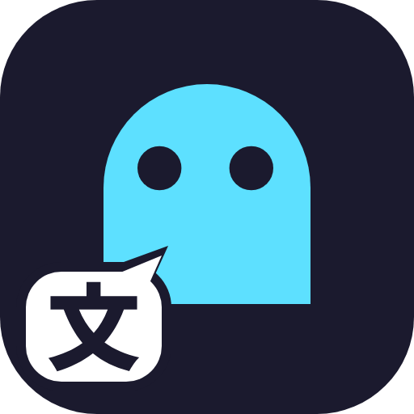
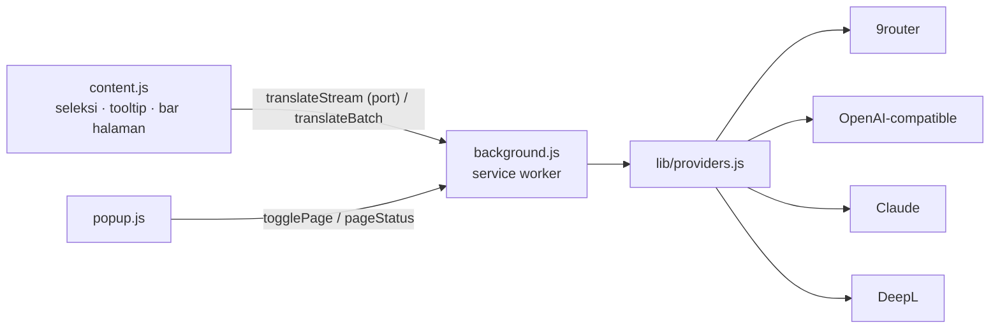

<div align="center">



# Wraith Translate 

<sub>🌐 [English](README.md) &nbsp;·&nbsp; **Bahasa Indonesia**</sub>

### Seleksi teks atau terjemahkan satu halaman penuh, langsung di browser Anda.

Penerjemah browser yang ringan, dengan AI pilihan Anda sendiri.<br>
Tanpa akun. Tanpa backend. Tanpa pelacakan. Hanya teks Anda dan provider yang Anda percaya.

<br>

[](src/manifest.json)
[](#-build)
[](#-fitur)

<sub>**Bekerja dengan**</sub><br>


<sub>**Berjalan di** &nbsp;Chrome · Edge · Brave · Opera · Vivaldi · Arc · Firefox 140+</sub>

<br>

[**Fitur**](#-fitur) &nbsp;•&nbsp;
[**Instalasi**](#-instalasi) &nbsp;•&nbsp;
[**Provider**](#-konfigurasi-provider) &nbsp;•&nbsp;
[**Cara pakai**](#-cara-pakai) &nbsp;•&nbsp;
[**Privasi**](#-izin-dan-privasi) &nbsp;•&nbsp;
[**Pengembangan**](#-build)

</div>

<br>

---

## ✨ Fitur

<table>
<tr>
<td width="50%" valign="top">

### 🔤 Terjemahan teks terseleksi
Seleksi teks, klik tombol kecil **文**, lalu baca hasilnya di tooltip. Ada tombol **Copy** dan menu *Translate to* yang tidak pernah mengubah bahasa tersimpan Anda. Terjemahan **tampil bertahap** saat model menulisnya.

</td>
<td width="50%" valign="top">

### 📄 Terjemahan satu halaman
Dua mode tampilan:
- **Replace text**: teks diganti di tempat, tata letak tetap utuh.
- **Show both**: terjemahan ditambahkan di bawah tiap paragraf, teks asli tetap terlihat.

</td>
</tr>
<tr>
<td width="50%" valign="top">

### 📜 Terjemahkan sambil scroll
Hanya teks di sekitar layar yang dikirim ke provider; sisanya diterjemahkan saat Anda sampai di sana. Hemat waktu dan biaya di halaman panjang.

</td>
<td width="50%" valign="top">

### 🧰 Popup, bar, shortcut
Popup toolbar, bar di halaman dengan progres, pengganti bahasa, tombol *Original/Translation*, dan Retry. Tekan **`Alt+W`** atau pakai menu klik kanan.

</td>
</tr>
<tr>
<td width="50%" valign="top">

### 🔌 4 jenis provider
**9router**, **Custom (OpenAI-compatible)**, **Claude**, **DeepL**. Hanya provider yang dipilih yang dipakai; pengaturan provider lain tetap tersimpan.

</td>
<td width="50%" valign="top">

### 🌍 16 bahasa tujuan
Indonesia, English, Japanese, Korean, Chinese (Simplified), Arabic, Spanish, French, German, Portuguese (Brazil), Russian, Italian, Dutch, Turkish, Polish, Ukrainian. Bahasa sumber dideteksi otomatis.

</td>
</tr>
<tr>
<td width="50%" valign="top">

### ⚡ Cepat dan tangguh
Teks halaman dikirim dalam batch kecil paralel (12 string, 5 sekaligus, teks yang tampil di layar lebih dulu) dan string yang sama diterjemahkan sekali. Error rate limit dan server diulang dengan backoff, dan batch yang dirusak model dipecah otomatis.

</td>
<td width="50%" valign="top">

### 🛡️ Aman untuk halaman
Kode (`<pre>`, `<code>`), kolom input, elemen `translate="no"` / `class="notranslate"`, dan elemen tersembunyi tidak disentuh.

</td>
</tr>
</table>

## 🌐 Dukungan browser

| Browser | Paket | Status |
|---|---|---|
| Chrome, Edge, Brave, Opera, Vivaldi, Arc | `wraith-translate-chromium-v*.zip` | ✅ Diuji di Chromium |
| Firefox 140+ | `wraith-translate-firefox-v*.zip` | ✅ Lolos `web-ext lint`; diuji manual (add-on sementara) |
| Safari (macOS/iOS) | belum dibuat | ⚠️ Perlu Xcode: `xcrun safari-web-extension-converter dist/chromium` |

## 📦 Instalasi

<details open>
<summary><b>Chrome, Edge, Brave, Opera, Vivaldi, Arc</b></summary>

1. Ekstrak `wraith-translate-chromium-v*.zip` ke sebuah folder (atau jalankan [build](#-build) lalu pakai `dist/chromium`).
2. Buka halaman extension: `chrome://extensions` (`edge://extensions`, `brave://extensions`, `opera://extensions`, `vivaldi://extensions`).
3. Aktifkan **Developer mode**, klik **Load unpacked**, lalu pilih folder hasil ekstrak.
4. Halaman pengaturan terbuka otomatis. Pilih provider, isi detailnya, klik **Save settings**, lalu **Test translation**.

> [!TIP]
> Setelah mengubah kode, klik ikon reload pada kartu extension, lalu reload tab yang sedang diuji.

</details>

<details>
<summary><b>Firefox (140 atau lebih baru)</b></summary>

1. Buka `about:debugging#/runtime/this-firefox` → **Load Temporary Add-on** → pilih `manifest.json` dari `dist/firefox` (atau zip-nya). Add-on sementara hilang saat Firefox ditutup.
2. Untuk pemasangan permanen, tanda tangani paket di [addons.mozilla.org](https://addons.mozilla.org) (kanal *unlisted* sudah cukup), atau pakai Firefox Developer Edition / Nightly dengan `xpinstall.signatures.required` diatur ke `false`.
3. Buka halaman pengaturan dan klik **Allow access** pada banner agar tombol seleksi bekerja di semua situs. (Terjemahan halaman dari popup tetap jalan tanpa izin ini.)

</details>

## 🔑 Konfigurasi provider

<details open>
<summary><b>9router</b></summary>

1. Pastikan 9router berjalan dan minimal satu koneksi AI aktif di dashboard-nya.
2. **Base URL**: misalnya `http://localhost:20128/v1` (atau alamat server Anda).
3. **API key**: dari dashboard 9router (kosongkan jika auth mati).
4. Klik **Connect**. Model dimuat dari `GET {baseUrl}/models` dan dikelompokkan berdasarkan prefix sebelum `/`.
5. Pilih model lalu **Save settings**.

Terjemahan dikirim ke `POST {baseUrl}/chat/completions` dengan header `Authorization: Bearer …`. Untuk alamat selain `localhost` / `127.0.0.1`, browser meminta izin akses saat Anda klik Connect atau Save.

</details>

<details>
<summary><b>Custom (OpenAI-compatible)</b></summary>

Pilih preset **Service**, atau *Other* lalu ketik Base URL sendiri.

| Preset | Base URL |
|---|---|
| OpenAI | `https://api.openai.com/v1` |
| OpenRouter | `https://openrouter.ai/api/v1` |
| Groq | `https://api.groq.com/openai/v1` |
| Google Gemini | `https://generativelanguage.googleapis.com/v1beta/openai` |
| DeepSeek | `https://api.deepseek.com/v1` |
| Mistral | `https://api.mistral.ai/v1` |
| Together AI | `https://api.together.xyz/v1` |
| Ollama (lokal) | `http://localhost:11434/v1` |
| LM Studio (lokal) | `http://localhost:1234/v1` |

Jika Ollama membalas 403, jalankan dengan `OLLAMA_ORIGINS=chrome-extension://*`. Beberapa layanan tidak menyediakan `/models`; periksa dokumentasi layanan tersebut.

</details>

<details>
<summary><b>Claude</b></summary>

Buat API key di Anthropic Console, tempel ke **API key**, klik **Load models** (`GET https://api.anthropic.com/v1/models`), pilih model, lalu simpan. Terjemahan memakai `POST /v1/messages`. Model yang lebih kecil biasanya lebih cepat dan murah untuk terjemahan pendek.

</details>

<details>
<summary><b>DeepL</b></summary>

Tempel authentication key. Key berakhiran `:fx` otomatis memakai `api-free.deepl.com`; selain itu memakai `api.deepl.com`. Tidak ada pilihan model. Saat kuota habis muncul error 456.

</details>

### Provider mana yang sebaiknya dipilih?

| | 9router | Custom | Claude | DeepL |
|---|---|---|---|---|
| **Jenis** | Gateway ke banyak model AI | Model bahasa, per layanan | Model bahasa | Mesin terjemahan |
| **Pilihan model** | Dari 9router Anda | Dari layanan | Dari akun Anda | Tidak ada |
| **Kecepatan** | Tergantung model | Tergantung layanan | Cepat sampai sedang | Sangat cepat |
| **Konteks dan gaya** | Bagus | Bagus | Sangat bagus | Terbatas, konsisten |
| **Biaya** | Mengikuti provider di belakangnya | Mengikuti layanan | Bayar per token | Gratis dengan batas, atau Pro |

> [!TIP]
> Model bahasa menulis hasil token demi token, jadi lebih lambat dari DeepL. Pilih model kecil yang cepat (varian *flash*, *mini*, *haiku*) dan hindari model *reasoning* untuk terjemahan. Hasil pengukurannya ada di [Memilih model](#-memilih-model).

### 🏁 Memilih model

Terjemahan tidak butuh reasoning, jadi model terbaik adalah yang **kecil dan cepat**. Di **Settings**, model yang direkomendasikan diberi tanda **★** dan muncul sebagai tombol sekali klik di bawah daftar model (rekomendasinya ada di `src/lib/recommended.js`).

Berikut hasil uji kecepatan, supaya Anda tidak perlu mengulangnya. Kondisi: model diakses lewat [9router](https://github.com/decolua/9router) di PC lokal, satu prompt (`Translate to Indonesian: CachyOS Dethroned SteamOS on Steam — Desktop Linux Gaming Has a New Center of Gravity`), streaming aktif, masing-masing dua putaran, pada 2026-10-04. Waktu dalam detik sampai **kata pertama / sampai selesai**, diukur dengan `curl`.

| Model | Putaran 1 | Putaran 2 | Kesimpulan |
|---|---|---|---|
| `gemini/gemini-3.5-flash-lite` | 0,87 / 1,21 | 0,83 / 1,14 | 🥇 **Tercepat dan stabil. Direkomendasikan.** |
| `kr/claude-haiku-4.5` | 3,03 / 3,04 | 1,47 / 1,47 | 👍 Alternatif bagus |
| `gemini/gemini-3.1-flash-lite-preview` | 3,63 / 3,89 | 2,02 / 2,37 | 👌 Cukup |
| `kr/deepseek-3.2` | 2,22 / 2,22 | 8,43 / 8,43 | ⚠️ Tidak stabil |
| `ag/gemini-3.8-flash-low` | 2,66 / 3,39 | 6,17 / 7,20 | ⚠️ Tidak stabil |
| `ag/gemini-3-flash` | 8,94 / 9,54 | 12,47 / 12,75 | 🐌 Lambat: hindari |
| `gemini/gemma-4-31b-it` | 22,44 / 24,18 | 27,95 / 59,49 | 🐌 Sangat lambat: hindari |
| `ag/gemini-3.5-flash-extra-low` | n/a | n/a | ❌ Sudah dihentikan (lihat di bawah) |
| `cx/gpt-5.4-mini` | n/a | n/a | ❔ HTTP 400 pada request ini, tidak terukur |

**Yang ditunjukkan hasil uji ini**

- **Modellah yang menentukan kecepatan, bukan extension.** Setelah kata pertama muncul, terjemahan singkat selesai dalam sekitar setengah detik. Menunggunya terjadi sebelum kata pertama, dan sangat berbeda antar model dan rute.
- **Meminta thinking lebih sedikit tidak membantu di sini.** Pada `ag/gemini-3-flash`, nilai `reasoning_effort` `none`, `minimal`, `low`, dan bawaan semuanya tetap 4,6–12,5 detik sampai kata pertama, karena 9router menyatakan pengaturan itu tidak didukung untuk model tersebut. Extension tetap mengirim pengaturan teringan yang diterima tiap model (dan mengingatnya), tetapi yang benar-benar berhasil adalah memilih model yang cepat.
- **Model yang sudah dihentikan bisa tampak seperti berhasil.** `ag/gemini-3.5-flash-extra-low` menjawab dalam 0,09 detik dengan HTTP 200, tetapi "terjemahannya" ternyata pesan *"Gemini 3.5 Flash is no longer available…"*. Jika hasil terasa terlalu cepat, baca isinya.
- Model "lite" paling cepat, tetapi bisa terdengar kurang halus pada teks panjang atau bernuansa. Jika begitu, `kr/claude-haiku-4.5` (atau Claude Haiku lewat provider Claude) adalah langkah berikutnya.

> [!NOTE]
> Ini satu prompt, dua putaran, satu mesin dan jaringan, lewat satu gateway. Nama dan ketersediaan model sering berubah, dan hasil bergantung pada beban dan lokasi. Anggap urutannya sebagai panduan, lalu ulangi uji dengan model Anda sendiri.

<details>
<summary><b>Jalankan uji kecepatan sendiri</b></summary>

```bash
KEY="ISI_KEY_9ROUTER"            # hapus header Authorization jika gateway Anda tanpa auth
URL=http://localhost:20128/v1/chat/completions
for M in gemini/gemini-3.5-flash-lite kr/claude-haiku-4.5 MODEL/LAIN-ANDA; do
  echo "== $M"
  for i in 1 2; do
    curl -s -o /dev/null -w "status=%{http_code} kata-pertama=%{time_starttransfer}s total=%{time_total}s\n" $URL \
      -H "Authorization: Bearer $KEY" -H 'Content-Type: application/json' \
      -d "{\"model\":\"$M\",\"stream\":true,\"max_tokens\":80,\"messages\":[{\"role\":\"user\",\"content\":\"Translate to Indonesian: CachyOS Dethroned SteamOS on Steam — Desktop Linux Gaming Has a New Center of Gravity\"}]}"
  done
done
```

`kata-pertama` adalah yang Anda rasakan sebagai "menunggu". `status` harus `200`; jika bukan, modelnya tidak tersedia untuk Anda. Tambahkan `"reasoning_effort":"low"` ke JSON untuk melihat apakah model Anda bereaksi terhadapnya.

</details>

## 🚀 Cara pakai

### Teks terseleksi
1. Seleksi teks di halaman web.
2. Klik tombol **文** yang muncul di dekat seleksi.
3. Baca hasilnya di tooltip. Tekan `Esc` atau klik di tempat lain untuk menutupnya. Setiap terjemahan dibatasi **5.000 karakter**.

### Halaman penuh

| Cara | Langkah |
|---|---|
| Toolbar | Klik ikon extension → **Translate this page** |
| Klik kanan | **Translate this page with Wraith Translate** |
| Shortcut | **`Alt+W`** (ubah di `chrome://extensions/shortcuts` / `about:addons` → Manage Extension Shortcuts) |

Untuk mengembalikan halaman: popup → **Show original page**, tombol **×** di bar, atau `Alt+W` lagi.

## ⚙️ Pengaturan

Buka tab **Settings** (atau *Open settings* di popup):

| Pengaturan | Fungsi |
|---|---|
| Translate selected text | Mati = tombol seleksi tidak muncul di mana pun |
| Translate full page | Mati = tombol popup, shortcut, dan menu klik kanan nonaktif, dan halaman yang sedang diterjemahkan dikembalikan |
| Page display | *Replace text* atau *Show both* (berlaku pada terjemahan halaman berikutnya) |
| Translate as you scroll | Hidup = terjemahkan teks dekat layar saja. Mati = terjemahkan semuanya sekaligus |
| Provider, model, dan bahasa tujuan | Lihat [Konfigurasi provider](#-konfigurasi-provider). Model yang direkomendasikan diberi tanda ★ dan tersedia sebagai tombol sekali klik, lihat [Memilih model](#-memilih-model) |

Perubahan fitur langsung berlaku di tab yang sudah terbuka, tanpa reload. Tab **Docs** berisi dokumentasi lengkap di dalam extension.

## 🔒 Izin dan privasi

| Izin | Alasan |
|---|---|
| `storage` | Menyimpan pengaturan di browser ini |
| `activeTab`, `scripting` | Menyiapkan tab aktif untuk terjemahan halaman (klik ikon, shortcut, menu klik kanan) |
| `contextMenus` | Menambahkan *Translate this page* ke menu klik kanan |
| Semua situs (content script) | Tombol seleksi, tooltip, dan penerjemahan teks di halaman |
| `api.anthropic.com`, `api.deepl.com`, `api-free.deepl.com` | Memanggil API Claude dan DeepL |
| `localhost`, `127.0.0.1` | 9router lokal atau server model lokal |
| Akses opsional per alamat | Hanya diminta saat 9router/Custom memakai alamat lain |

- 📤 Teks yang diseleksi dikirim **hanya ke provider pilihan Anda**, dan hanya setelah Anda menekan tombol terjemahkan. Teks halaman dikirim hanya setelah Anda memulai terjemahan halaman.
- 🗝️ API key disimpan di `chrome.storage.local` pada perangkat ini (tidak disinkronkan ke akun browser Anda). Key tidak pernah masuk ke halaman web: semua panggilan API dilakukan oleh service worker.
- 🧱 Terjemahan ditampilkan sebagai teks biasa, bukan HTML, dan teks sumber diperlakukan sebagai data, bukan perintah, untuk mengurangi risiko prompt injection dari halaman web.

> [!WARNING]
> Jangan menerjemahkan teks rahasia lewat provider yang tidak Anda percaya. Baca [kebijakan privasi](PRIVACY.md) selengkapnya.

## 🧩 Struktur proyek

```
.
├── src/                    kode extension (manifest Chromium adalah sumber utama)
│   ├── manifest.json
│   ├── background.js       service worker: terjemahan, shortcut, menu, injeksi script
│   ├── content.js          tombol seleksi, tooltip, penerjemah halaman, bar (Shadow DOM)
│   ├── popup.html/css/js   popup toolbar
│   ├── options.html/css/js halaman pengaturan + dokumentasi
│   ├── lib/
│   │   ├── providers.js    panggilan API (single + batch)
│   │   ├── defaults.js     default dan pembaca pengaturan
│   │   ├── recommended.js  model yang direkomendasikan di Settings
│   │   ├── languages.js    daftar bahasa + kode DeepL
│   │   └── presets.js      preset layanan OpenAI-compatible
│   └── icons/              16, 48, 128 px
├── assets/                 logo (SVG + PNG), social preview, ikon toko
├── build.py                membuat dist/chromium, dist/firefox, dan zip
├── tests/                  tes end-to-end (Playwright + Chromium)
├── AGENTS.md               panduan arsitektur untuk developer / asisten AI
├── PRIVACY.md              kebijakan privasi (tautkan di listing toko)
├── STORE_LISTING.md        teks listing toko siap tempel
└── dist/                   hasil build (di-generate, jangan diedit)
```

### Cara kerjanya



`content.js` berkomunikasi dengan `background.js` (teks terseleksi lewat port streaming, batch halaman lewat pesan), yang membaca pengaturan lalu memanggil `lib/providers.js`. Alur pesan, protokol batch, dan cara menambah provider, bahasa, atau pengaturan didokumentasikan di [`AGENTS.md`](AGENTS.md).

## 🛠️ Build

Tanpa dependensi runtime atau bundler. Butuh Python 3:

```bash
python3 build.py
```

```
dist/chromium/                              folder siap untuk Load unpacked
dist/firefox/                               folder siap untuk Load Temporary Add-on
dist/wraith-translate-chromium-v<ver>.zip
dist/wraith-translate-firefox-v<ver>.zip
```

Manifest Firefox dibuat otomatis dari `src/manifest.json` (background script + `browser_specific_settings.gecko`). Naikkan `version` di `src/manifest.json` untuk setiap rilis. Lint Firefox: `npx web-ext lint -s dist/firefox`.

## 🧪 Pengujian

Tes otomatis memakai server OpenAI tiruan lokal dan Chromium headless:

```bash
pip install playwright
python3 build.py
python3 tests/e2e_page.py            # replace/bilingual/lazy/restore, kode dan notranslate dilewati, saklar fitur, jalur error
python3 tests/e2e_popup_inject.py    # popup menyimpan pengaturan, togglePage, injeksi script sesuai kebutuhan
```

Screenshot tes disimpan di `tests/out/`.

<details>
<summary><b>Skenario tes manual</b></summary>

1. 9router: Connect, daftar model muncul, pilih satu, simpan, *Test translation* berhasil.
2. Seleksi satu kalimat di halaman biasa: tombol muncul, klik, tooltip menampilkan hasil lengkap tanpa scrollbar di dalamnya.
3. Seleksi teks di dalam `<textarea>`: tombol tetap muncul.
4. Pakai menu *Translate to* di tooltip: teks yang sama diterjemahkan ulang ke bahasa itu dan bahasa tujuan tersimpan tidak berubah. `Esc` atau klik di tempat lain menutup tooltip.
5. Pakai API key yang salah: tooltip menampilkan pesan 401/403 dan tombol *Open settings*.
6. Matikan 9router lalu terjemahkan: muncul pesan "Cannot reach…".
7. Seleksi lebih dari 5.000 karakter: muncul pesan "Text is too long".
8. Ganti ke Custom (pilih preset, Connect), Claude, dan DeepL; ulangi langkah 2.
9. Di `chrome://extensions` tombol tidak muncul (memang seharusnya begitu).
10. Reload extension tanpa reload tab: muncul pesan "Extension was updated".
11. Matikan *Translate selected text*, Save, reload tab: menyeleksi teks tidak memunculkan tombol; tombol popup tetap menerjemahkan halaman.
12. Matikan *Translate full page*, Save: menu klik kanan hilang dan tombol popup nonaktif.
13. Terjemahkan artikel panjang dengan *Replace text*: teks yang terlihat berubah, blok kode tidak tersentuh, scroll menerjemahkan sisanya. *Show original page* mengembalikan semuanya.
14. Mode *Show both*: terjemahan muncul di bawah tiap paragraf; tombol *Original* di bar menyembunyikan/menampilkannya.
15. API key salah saat terjemahan halaman: bar menampilkan error dengan Retry dan Settings.
16. Klik ikon di tab yang dibuka sebelum extension dipasang/di-reload: popup terbuka dan terjemahan tetap berfungsi.
17. Klik ikon di `chrome://extensions`: popup menyatakan halaman tidak bisa diterjemahkan; *Open settings* tetap berfungsi.

</details>

## 🩺 Pemecahan masalah

<details>
<summary><b>Buka tabel gejala</b></summary>

<br>

| Gejala | Penyebab dan solusi |
|---|---|
| Tombol seleksi tidak muncul | Reload tab setelah instalasi atau update. Pastikan halamannya bukan `chrome://`, Web Store, atau PDF viewer bawaan. Di Firefox, klik **Allow access** di Settings. |
| Tanda ! merah di ikon / "Couldn't reach this page" | Halaman tidak bisa menjalankan extension (`chrome://`, Web Store, PDF viewer) atau memblokir script. Jika masih gagal, reload tab. |
| "Cannot reach…" | 9router atau layanan lokal tidak berjalan, Base URL salah, atau izin akses alamat belum diberikan. Klik Connect lagi dan setujui izinnya. |
| 401 / 403 | API key salah, kedaluwarsa, atau tidak punya akses ke model itu. |
| 404 | Base URL tidak berakhiran `/v1`, atau modelnya sudah tidak ada. Muat ulang daftar model. |
| 429 | Rate limit tercapai. Tunggu sebentar atau ganti model. |
| 456 (DeepL) | Kuota karakter bulanan habis. |
| Daftar model kosong | Belum ada AI yang terhubung di 9router, atau key tidak bisa membaca daftar model. |
| Hasil mengandung komentar tambahan | Sebagian model kecil mengabaikan instruksi. Pilih model lain. |
| Terjemahan lambat | Biasanya penyebabnya model, bukan extension. Pilih model bertanda ★ di Settings, hindari model reasoning, atau pakai DeepL. Lihat [Memilih model](#-memilih-model). |
| Halaman hanya sebagian diterjemahkan | Kode, kolom input, dan elemen tersembunyi sengaja dilewati. Matikan *Translate as you scroll* untuk menerjemahkan semuanya sekaligus, atau tekan Retry setelah error. |
| "Extension was updated" | Reload tab yang sedang Anda buka. |

</details>

## 📌 Batasan

- Mode *Replace text* menerjemahkan potongan demi potongan, sehingga kalimat yang terpecah oleh tag inline (`<b>`, `<a>`) diterjemahkan terpisah. Mode *Show both* menerjemahkan seluruh blok dan terbaca lebih natural.
- Konten yang dimuat setelah terjemahan dimulai (infinite scroll) diterjemahkan begitu scroll berhenti; konten dinamis yang terus berubah bisa memicu terjemahan berulang.
- Terjemahan teks terseleksi tampil bertahap saat model menulisnya. Terjemahan satu halaman terisi per batch (satu batch muncul setelah seluruh balasannya selesai).
- Firefox hanya diuji manual sebagai add-on sementara (belum ada tes otomatis Firefox); Safari belum dibuat.

## 🆕 Yang baru di 1.4.0

- 🌊 **Streaming** untuk teks terseleksi: tooltip terisi saat model menulis, dan menutupnya membatalkan request.
- ⚡ **Halaman lebih cepat**: batch lebih kecil (12 string / 1.000 karakter), 5 paralel, teks di layar lebih dulu, dan batch yang dirusak model dipecah secara paralel, tidak lagi satu belahan demi satu.
- 🔁 **Request lebih tangguh**: retry otomatis dengan backoff pada 429/5xx (`Retry-After` dihormati), batas waktu 90 detik, dan blok `<think>…</think>` dari model lokal dibuang.
- 🧠 **Thinking lebih ringan**: untuk model yang berpikir (Gemini, GPT-5, Qwen3, …) extension meminta reasoning paling sedikit yang diterima server dan mengingat apa yang berhasil; model lain memakai `temperature: 0`.
- 🏁 **Model rekomendasi** bertanda ★ di Settings dengan tombol sekali klik, plus tabel kecepatan hasil pengukuran di atas.

## 🤝 Kontribusi

Edit hanya `src/`, jalankan `python3 build.py`, lalu jalankan tes di atas. Aturan dan panduan lengkap (peta file, protokol pesan, cara menambah provider, bahasa, atau pengaturan, jebakan umum) ada di [`AGENTS.md`](AGENTS.md).

> [!NOTE]
> Jaga agar `README.md` dan `README.id.md` tetap sinkron saat mengubah dokumentasi.

<br>

---

<div align="center">


<sub>**Wraith Translate** · v1.4.0 · Menerjemahkan diam-diam, seperti hantu 👻</sub>

</div>
